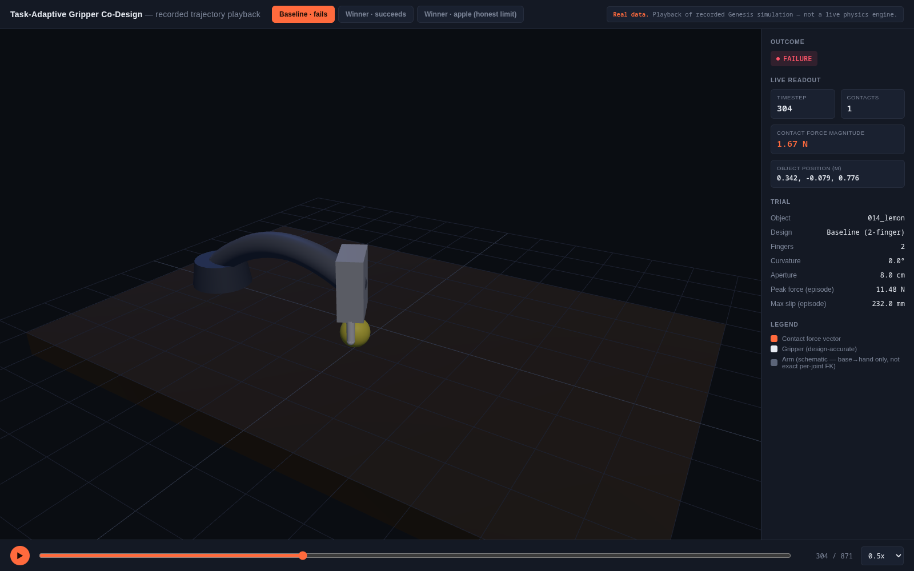

# FruitGrip-CoDesign

**Gripper geometry is a free variable manipulation research has held constant — jointly searching geometry and control finds task-adaptive hardware no policy-only optimization can reach, and it works by resisting rotation, not squeezing harder.**

[]()
[]()
[]()
[]()
[]()
[]()
[]()



**Interactive 3D replay** of real recorded Genesis physics trajectories — scrubbable: baseline failing, the winning design succeeding, and its one honest failure mode.

**[▶ Open the live interactive demo](https://chanikkyasaai.github.io/Radeon-hackathon-2026-07/fruitgrip-codesign/demo/interactive_3d/index_artifact.html)** — hosted straight from this repo via GitHub Pages, no clone needed. (GitHub can't render `.html` files live from its own blob viewer, only as source text — this is a real hosted page, not a link into the repo tree.) To run it locally instead: clone the repo and open [`demo/interactive_3d/index.html`](demo/interactive_3d/index.html) directly in a browser.

## What this is

A task-adaptive Franka Panda end-effector, co-designed jointly with its scripted controller on the [Genesis](https://github.com/Genesis-Embodied-AI/Genesis) physics engine (ROCm/AMD GPU-accelerated), picking fruit off a table and placing it in a bowl. AMD AI DevMaster Hackathon, Track 3: Physical AI. Every claim below is backed by a statistically-powered evaluation, a raw JSON file in `results/`, and an exact reproduction command in [`docs/REPRODUCIBILITY.md`](docs/REPRODUCIBILITY.md).

## Key findings

- **93.3% vs 26.7% pick-and-place success** (n=30 paired trials, 95% Wilson CIs `[78.7%, 98.2%]` vs `[14.2%, 44.4%]` — non-overlapping, statistically distinguishable) between a CMA-ES-searched 3-finger gripper and a stock-equivalent 2-finger baseline. → [core confirmation](results/01_core_confirmation/findings.md)
- **The mechanism is geometry, not force**: both designs carry 20–37x more grip force than physically required to hold the object — the success gap is explained by 3 distributed contact points resisting rotation/slip, not a harder squeeze. → same doc, §2
- **80.3% ± 17.7% of the total gain is attributable to geometry**, not the controller (5-seed attribution experiment) — the winning design holds 100% success across every seed; the baseline swings 0–66.7%. → [attribution](results/02_attribution_multiseed/)
- **Generalization is real but precisely bounded — a strength stated with the same confidence as the wins.** Tested on 36 diverse YCB objects, not just more fruit: the advantage is category-specific (round/curved objects favor the winner, flat-faced objects favor the baseline), and this session directly instrumented *why* via contact-normal alignment rather than leaving it as an observation. → [generalization](results/03_generalization/) · [contact-geometry mechanism](results/07_contact_geometry/contact_geometry_findings.md)
- **ROCm/AMD GPU, the full honest arc**: naive single-environment GPU is 2.5–3.6x *slower* than CPU (diagnosed why, not hidden) → properly batched GPU is up to **16x faster** (correctness-validated against CPU) → raw physics-step throughput ceiling is **29.4x** CPU's peak (148,419 vs 5,052 env-steps/sec) → and a further engineering finding: GPU batching accelerates *re-validating known candidates* (17x) far more than it accelerates *searching* for new ones, because scene-build cost — not step throughput — dominates search-loop wall time. → [ROCm benchmark](results/04_rocm_benchmark/rocm_findings.md) · [GPU-corrected search](results/06_fruit_archive_qd/gpu_corrected_findings.md)
- **Independently cross-validated across two physics engines, not just internally reliable.** Replicated the full protocol in MuJoCo, found the result direction reverses there, then explained why with a controlled friction dose-response sweep run in both engines — the reversal is mechanistically understood, not an unexplained artifact. → [cross-simulator replication](results/05_cross_simulator/)

## Architecture

```
gripper_gen.py  →  evaluate.py / search.py / fruit_archive.py  →  confirmation-eval (n=30, Wilson CI)
     │                          │                                          │
parametric N-finger    CMA-ES + quality-diversity search          statistically powered
geometry (MJCF)        over (finger_length, curvature,             comparison vs. frozen
                        aperture, compliance)                      baseline
     │                          │                                          │
     └──────────────→  scripted grasp controller  ──────────→  cross-simulator replication
                        (co-adapted per design)                  (Genesis ⇄ MuJoCo, ROCm GPU)
```

Franka Panda + parametric gripper → co-adapted scripted controller → domain-randomized physics trial (friction, mass, pose) → aggregated success/force/slip → statistically powered comparison, replicated across engines and hardware backends.

## Quickstart

Reproduce the headline result (Genesis, CPU, a few minutes):

```bash
cd franka_fruit_pick_demo
uv sync
uv run python franka_fruit_pick/codesign/confirmation_eval.py --n-trials 30
```

Expected output: a table matching `results/01_core_confirmation/findings.md`'s headline numbers, written to `results/01_core_confirmation/confirmation_eval.json`.

→ Full setup (including ROCm GPU wheels) and one exact command per result table: [`docs/REPRODUCIBILITY.md`](docs/REPRODUCIBILITY.md)
→ Full write-up — methodology, every result, limitations stated plainly: [`docs/TECHNICAL_REPORT.md`](docs/TECHNICAL_REPORT.md)
→ Frozen design parameters (the exact two `GripperParams` every table above measures): [`configs/frozen_designs.py`](configs/frozen_designs.py)

## Repository layout

```
├── README.md                 you are here
├── docs/
│   ├── TECHNICAL_REPORT.md   full methodology, results, limitations
│   ├── REPRODUCIBILITY.md    one exact command per result table
│   └── images/
├── configs/
│   └── frozen_designs.py     the winner + baseline GripperParams, checked in
├── franka_fruit_pick/        the package (kept at repo root — see note below)
│   └── codesign/             all co-design, search, cross-simulator, QD code
│       └── mujoco_repl/      the MuJoCo replication port
├── results/                  every finding, organized by topic, raw JSON + .md
│   ├── 01_core_confirmation/  02_attribution_multiseed/  03_generalization/
│   ├── 04_rocm_benchmark/     05_cross_simulator/         06_fruit_archive_qd/
│   └── 07_contact_geometry/
├── demo/
│   └── interactive_3d/       scrubbable replay of real recorded trajectories
├── scripts/
│   └── run_all_confirmation_evals.sh
└── assets/, datasets/        bundled meshes / robot model (see credits below)
```

*Note: `franka_fruit_pick/` stays at the repo root rather than moving under `src/` — every module in `codesign/` locates `results/`, `assets/`, and its sibling modules via paths relative to its own location, and this project prioritized not risking that working, statistically-validated code over a cosmetic move under a hard deadline.*

## Foundation

This project's controller, scene, and domain-randomization layers are built on top of a scripted-to-learned Franka fruit-pick reference pipeline (Genesis + LeRobot). That base pipeline's own M1–M5 walkthrough (scene → scripted policy → dataset recording → domain randomization → policy training/eval) is preserved under `franka_fruit_pick/` for reference; this README and `docs/TECHNICAL_REPORT.md` document what this project adds on top of it — the co-design search, statistical validation, cross-simulator replication, and ROCm benchmarking.

## Credits & asset sources

Assets under `assets/` are not original to this repo:
- **Franka Panda robot model** — from [Genesis](https://github.com/Genesis-Embodied-AI/Genesis)'s bundled assets.
- **YCB object meshes** — from the [ManiSkill2](https://github.com/haosulab/ManiSkill) dataset, originally the [YCB Object and Model Set](https://www.ycbbenchmarks.com/).

Refer to the upstream projects for their licenses if redistributing these assets.

## Team

**Chanikya Nelapatla** — AMD AI DevMaster Hackathon, Track 3: Physical AI.

## License

[MIT](LICENSE). Genesis is Apache 2.0; YCB/ManiSkill2 assets remain under their own licenses (see Credits above).
