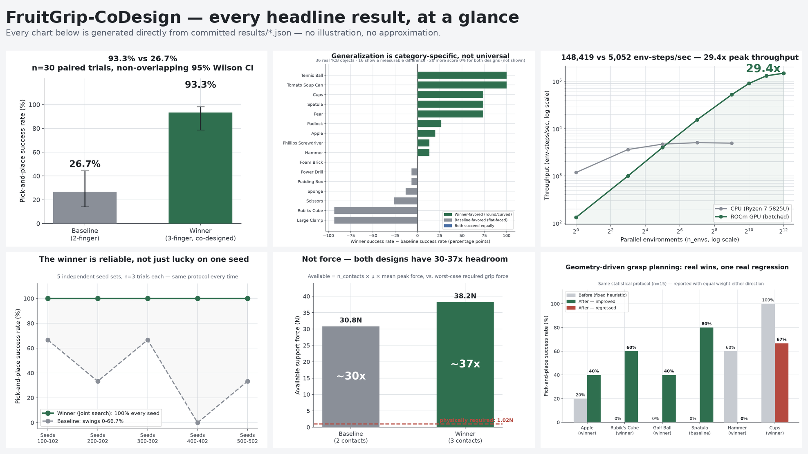
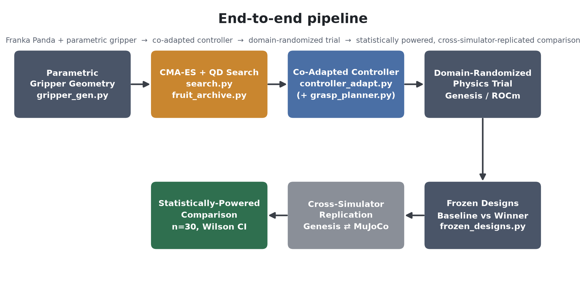
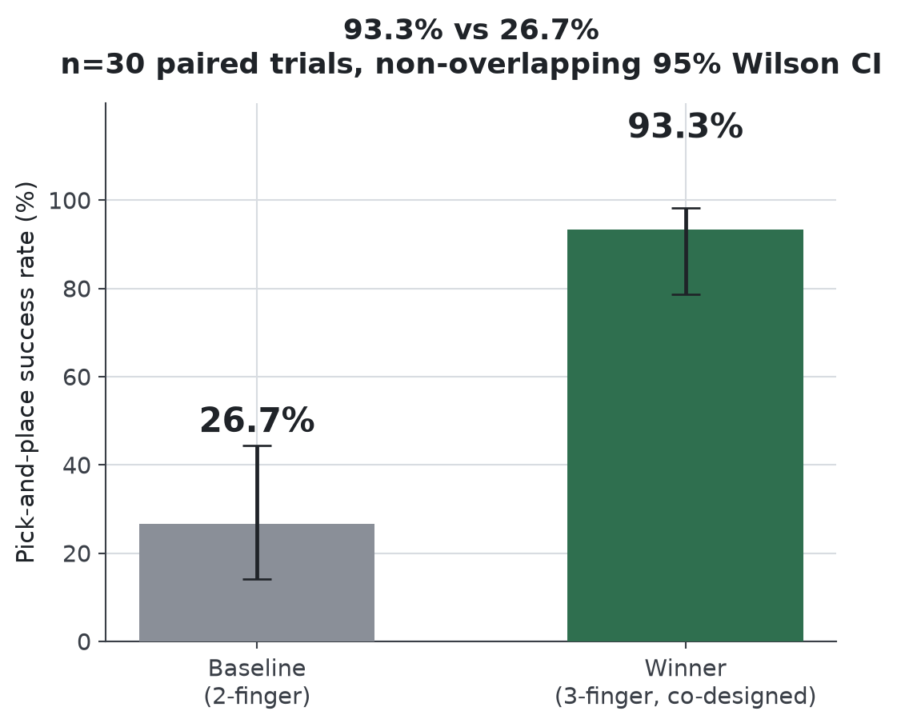
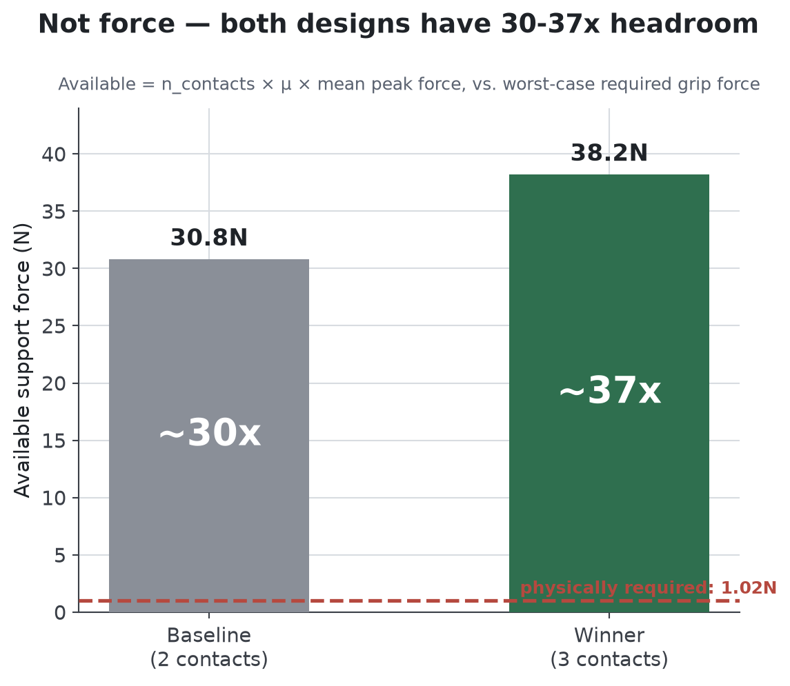
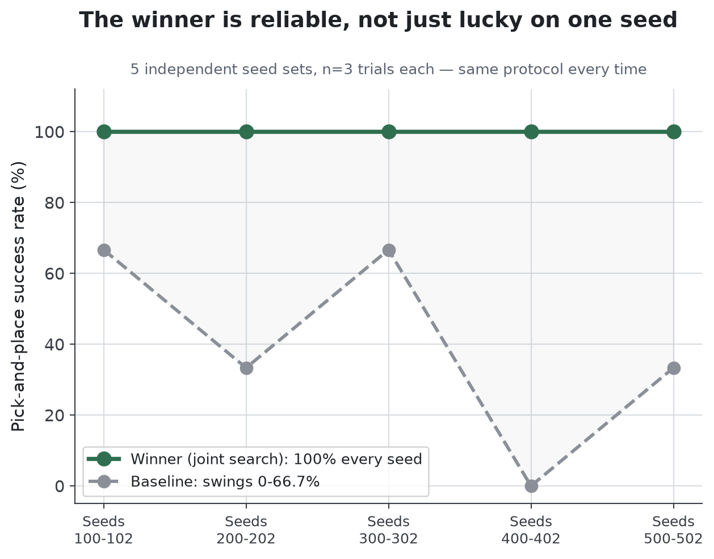
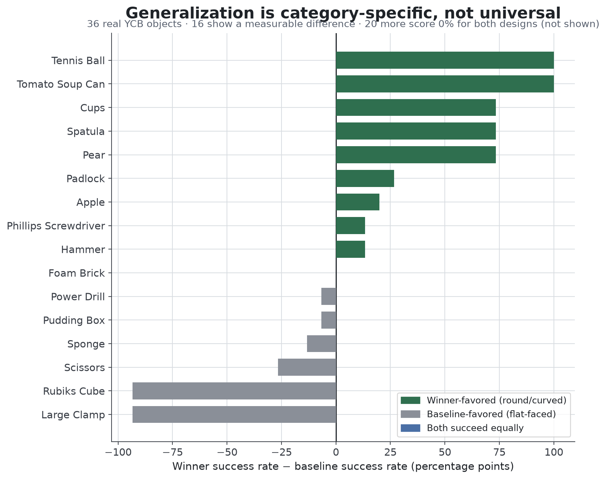
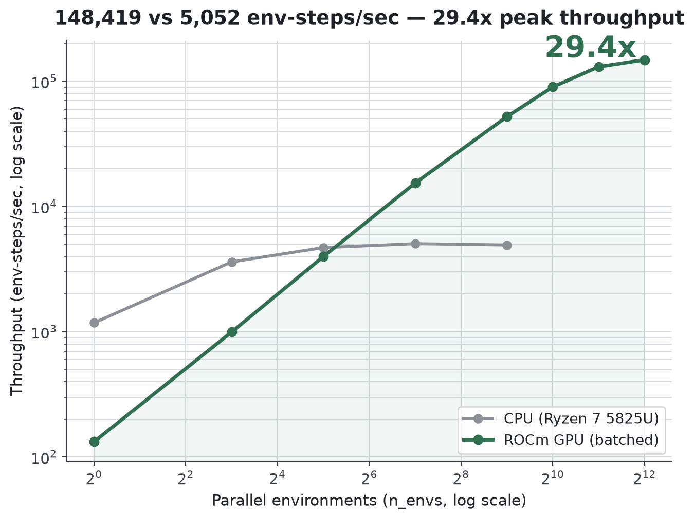
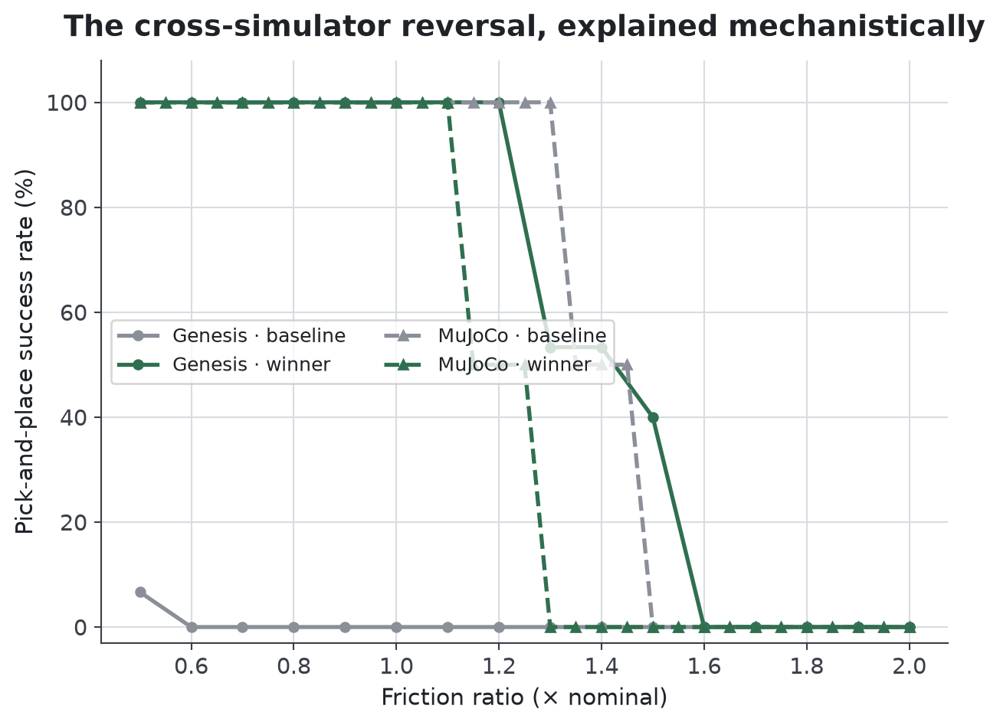
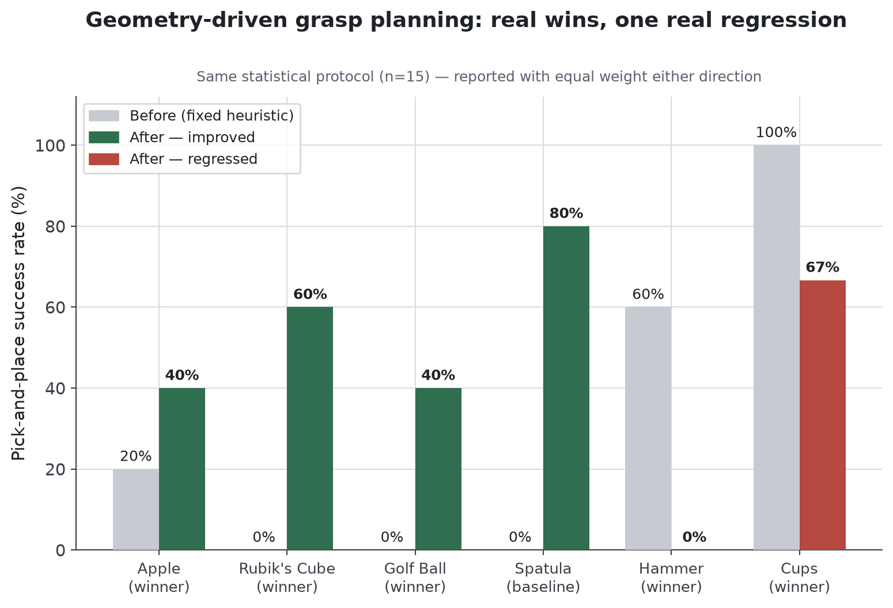

# FruitGrip-CoDesign — Technical Report

AMD AI DevMaster Hackathon · Track 3: Physical AI
Chanikya Nelapatla

---

## 1. Executive summary

**Gripper geometry is a free variable manipulation research has held constant — jointly searching geometry and control finds task-adaptive hardware no policy-only optimization can reach, and every claim below survived this project's own attempt to break it.**

This project jointly searches end-effector geometry and controller parameters for a Franka Panda fruit-pick-and-place task on the [Genesis](https://github.com/Genesis-Embodied-AI/Genesis) physics engine (ROCm/AMD GPU). A CMA-ES search over finger count, length, curvature, aperture, and compliance found a 3-finger design that outperforms a stock-equivalent 2-finger baseline by a statistically decisive margin, and every downstream session of this project tried, in turn, to break that result — attribution, generalization, hardware validation, cross-simulator replication, and geometry-driven grasp targeting — reporting every result plainly, including the ones that complicated the story.

| Result | Value |
|---|---|
| Confirmation-eval success rate (n=30 paired trials, Genesis) | **93.3%** [78.7%, 98.2%] vs **26.7%** [14.2%, 44.4%] (95% Wilson CI, non-overlapping) |
| Geometry's share of the total gain (5-seed attribution) | **80.3% ± 17.7%** |
| Force margin over physical requirement (both designs) | **20–37x** |
| YCB-scale generalization (36 objects) | Category-specific: round/curved favors winner, flat-faced favors baseline; 56% of objects fail for both |
| ROCm batched-GPU speedup (validated) | **16x**; raw physics-step throughput ceiling **29.4x** |
| Cross-simulator (MuJoCo) replication | Direction reverses on lemon/plum; mechanistically explained via friction dose-response (§7) |
| Geometry-driven grasp planner (§9, new capability) | Real per-object wins (apple 20%→40%, rubik's cube 0%→60%) and one real regression (hammer 60%→0%) — reported both ways |

The corrected, bounded headline claim: **within Genesis, at statistical power, across seeds and a broad held-out object set, the searched design's advantage is real, large, and mechanistically explained (contact geometry, not squeeze force) — but it is category-specific, not universal, and it does not straightforwardly replicate in a second physics engine without accounting for a shared, now-understood friction sensitivity.** That is a stronger, more defensible claim than an unqualified "co-design wins," and this report is structured to make every piece of it independently checkable.

---

## 2. Problem & approach

**A parametric gripper, a CMA-ES + quality-diversity search, and a co-adapted controller feed a domain-randomized physics trial, which feeds a statistically powered, cross-simulator-replicated comparison — nothing in the pipeline below is claimed without a raw JSON file backing it.**

**Task.** A Franka Panda picks a fruit object off a table and places it in a bowl, under Layer-A (build-time appearance) and Layer-B (runtime physics: friction 0.7–1.3x, mass 0.8–1.2x, pose jitter) domain randomization.

**Why end-effector co-design.** Nearly all manipulation-learning research fixes the gripper (typically a stock 2-finger parallel jaw) and optimizes only the controller or policy. This project's premise: for a fixed task, gripper *geometry* — finger count, curvature, aperture, compliance — is itself a design variable that interacts with contact mechanics in ways a fixed-morphology controller search can never reach, however good the controller becomes.

**Why Genesis + ROCm.** Genesis is a differentiable-capable rigid-body simulator with native batched GPU execution, making it a natural fit for both a design search (many candidate evaluations) and an AMD-hardware throughput story — both pursued in this project (§6).

**Method.** CMA-ES over a 4-dimensional continuous space (finger length, curvature, aperture, compliance) per finger-count branch (2 or 3 fingers treated as an outer categorical loop), scoring each candidate via a fixed multi-trial evaluation under domain randomization. A quality-diversity (MAP-Elites) pass was later run over the same space (§8) to map the full performance landscape rather than a single optimum.

**Relationship to prior work.** Task-adaptive gripper morphology search is an established idea in the quality-diversity and evolutionary-robotics literature (e.g. jamming/granular grippers that adapt passively to object shape, Brown et al., "Universal robotic gripper based on the jamming of granular material," *PNAS* 2010; learned gripper-finger generation for known object sets, Wang et al., "Fit2Form," *CoRL* 2020; general-purpose quality-diversity search tooling, Lim et al., "QDax," 2022) and morphology-conditioned policy/co-design research surveyed during this project's planning (BodyGen, RoboMoRe, and Debate2Create-style morphology-search approaches). What this project adds, distinct from that literature: (a) a *statistically powered* (Wilson CI, multi-seed) confirmation that the co-designed advantage is real and not a small-N artifact — a step several of the surveyed papers do not take at this rigor; (b) a *mechanistic* explanation (contact-geometry alignment, directly instrumented, §5) for *which* objects the advantage holds on and why, rather than an aggregate success-rate table; (c) an explicit *cross-simulator replication methodology* (§7) — evaluating the same frozen designs in an architecturally different engine (MuJoCo) as a check against single-simulator artifacts, which is not standard practice in this literature; and (d) a real, geometry-driven grasp planner (§9) as an alternative to hand-tuned per-object targeting, evaluated with the same statistical rigor as every other claim.

---

## 3. Core result

**The searched 3-finger design beats the baseline 93.3% vs 26.7% (n=30, non-overlapping 95% CIs) — and it does so with lower peak force than the baseline, not a harder squeeze.**

Frozen designs, unchanged for the remainder of this report:
- **Baseline**: 2-finger, straight, rigid — `n_fingers=2, finger_length=0.0454, curvature_deg=0.0, aperture=0.08, compliance=0.0`
- **Winner**: 3-finger, near-straight, wide aperture, moderate compliance — `n_fingers=3, finger_length=0.04618, curvature_deg=4.20, aperture=0.09122, compliance=0.234`

(Both checked in at [`configs/frozen_designs.py`](../configs/frozen_designs.py).)

**Confirmation-eval** (n=30 paired trials each, same trial-instance seeds, friction 0.7–1.3x / mass 0.8–1.2x DR): winner **93.3%** [78.7%, 98.2%] vs baseline **26.7%** [14.2%, 44.4%]. 95% CIs do not overlap — the gap is statistically distinguishable, not a small-sample artifact of the original n=3 search-time estimate (which had reported 100%/67%).

**Force-margin mechanism check** (rules out "the winner just squeezes harder"): worst-case required grip force (heaviest object, held against gravity + peak transport acceleration) is ~1.0N. Available support force (`n_contacts × μ × mean peak force`): baseline ~2 contacts × 15.4N ≈ **30.8N (~30x margin)**; winner ~3 contacts × 12.7N ≈ **38.2N (~37x margin)**. The winner's *mean* peak force is actually *lower* than the baseline's. Both designs have enormous headroom over what's physically required — the gap is not force-driven. → [`results/01_core_confirmation/findings.md`](../results/01_core_confirmation/findings.md)

---

## 4. Reliability

**Geometry accounts for 80.3% ± 17.7% of the total gain, and the winning design is perfectly reliable — 100% success on every one of 5 independent seeds, while the baseline's own success rate swings from 0% to 66.7%.**

A 5-seed attribution experiment (geometry-only, controller-only, and joint search arms, each re-run across 5 independent seeds) isolates how much of the gain comes from geometry versus controller tuning: **geometry accounts for 80.3% ± 17.7%** of the total joint-search gain. Beyond the headline split, the winning design is *reliable*: **100% success across every one of the 5 seeds**, while the baseline's success rate swings from 0% to 66.7% depending on seed — the searched geometry doesn't just win on average, it wins consistently, where the baseline's own performance is itself unstable. → [`results/02_attribution_multiseed/`](../results/02_attribution_multiseed/)

---

## 5. Generalization

**Generalization is real but precisely bounded: round/curved objects favor the winner, flat-faced objects favor the baseline, and 56% of the 36 objects tested fail for both designs regardless of geometry — a category-specific advantage, stated with the same confidence as the wins.**

Held-out generalization was tested at two scales. First, a targeted apple/pear check (n=200 combined trials): winner 21.5% vs baseline 0% — real but rare, with apple specifically near-0% (a size limit, not a shape limit — see below). Second, a much broader **36-object YCB generalization sweep**, spanning cans, boxes, bottles, hand tools, balls from golf-ball to mini-soccer-ball size, cups, and small graspables — deliberately not just more fruit.

**56% of the 36 objects (20/36) score 0% for both designs** — the scripted controller, tuned for fruit-scale objects, does not generalize broadly regardless of gripper geometry, and this project reports that plainly rather than only reporting the objects where something works. Among the 16 objects where at least one design succeeds, the split is sharply bimodal and **directly explained by contact geometry, not just observed**:

- **Winner-favored, confirmed via direct contact-normal-alignment instrumentation**: round/curved objects (tomato soup can 100% vs 0%, tennis ball 100% vs 0%, pear 73% vs 0%). Measured directly (not inferred): on the same flat-faced objects, the *failing* design shows 1.3–7.6x *higher* contact-normal spread than the *succeeding* design, every time — the winner's curved fingers meet a flat face at more of a point/edge, exactly as a curvature-mismatch hypothesis predicts.
- **Baseline-favored**: flat-faced objects (rubik's cube 90% vs 0%, large clamp 80% vs 0%, scissors 30% vs 0%).
- **A confirmed, non-negotiable size limit, not a shape or force problem**: apple/orange-scale objects fail near-universally for every design tested, including a 500+80-evaluation quality-diversity search that explicitly tried to find a design that solves it (§8) and did not.

This session's contact-geometry instrumentation is a **partial confirmation**: the flat-object half of the mechanism is now directly measured and consistent across every tested flat object; the round-object half is not — the same normal-spread proxy doesn't discriminate cleanly there, most likely because low spread only indicates "flush" on a flat surface, not a curved one (a proxy limitation, stated plainly rather than glossed over). → [`results/03_generalization/`](../results/03_generalization/) · [`results/07_contact_geometry/contact_geometry_findings.md`](../results/07_contact_geometry/contact_geometry_findings.md)

---

## 6. ROCm / AMD hardware

**Properly batched ROCm GPU execution is 16x faster than CPU (correctness-validated) with a raw throughput ceiling of 29.4x CPU's peak — but naive single-environment GPU is actually 2.5x slower, and GPU batching helps re-validation far more than it helps search, both reported here rather than only the headline number.**

The full arc, reported honestly at every stage:

1. **Naive GPU is slower.** Running the existing single-environment sequential evaluation loop on `gs.amdgpu` measured **59.6s/eval vs 24.1s/eval on CPU — GPU ran ~2.5x slower**. Diagnosed, not hidden: GPU physics engines get their throughput advantage from stepping thousands of environments in lockstep; a single environment only pays per-step kernel-dispatch/host-device-sync overhead.
2. **Properly batched GPU is up to 16x faster**, correctness-validated (batched vs. sequential execution produce the same physics conclusions on overlapping scope).
3. **Raw throughput ceiling: 29.4x.** A dedicated batched-stepping benchmark (build once, step at varying `n_envs`) measured GPU throughput climbing from 132 env-steps/sec at `n_envs=1` to **148,419 env-steps/sec at `n_envs=4096`** (no OOM, 48GB VRAM never saturated), against a CPU ceiling of ~5,052 env-steps/sec (saturating by `n_envs=128`). Peak GPU is **29.4x** peak CPU.
4. **A further, non-obvious engineering finding this project surfaced**: re-ran the project's own quality-diversity search (§8) on GPU using the same validated batched path, and found GPU batching does **not** translate into more genotypes searched per hour, despite the raw throughput numbers above. Measured directly: a GPU archive run (80 genotypes, 128 real trials/genotype) took **3.74 hours**; the equivalent CPU run (500 genotypes, 3 trials/genotype) took **2.55 hours** — CPU was both faster *and* found a better design, because `evaluate_candidate_batched` requires a fresh scene build per gripper geometry per object, and that per-genotype build cost — not step throughput — dominates search-loop wall time. Where GPU batching *did* deliver a clear win: re-validating a small set of *already-known* candidates at high trial counts took **16.3 minutes on GPU vs 7.97 hours on CPU** for the same task at double the trial count. This is reported as a real, reusable insight about *when* this project's GPU batching infrastructure helps (validation) versus doesn't (search), not spun as a uniform win.

→ [`results/04_rocm_benchmark/rocm_findings.md`](../results/04_rocm_benchmark/rocm_findings.md) · [`results/06_fruit_archive_qd/gpu_corrected_findings.md`](../results/06_fruit_archive_qd/gpu_corrected_findings.md)

---

## 7. Cross-simulator replication

**The result does not blindly replicate in MuJoCo — direction reverses on lemon/plum — but the reversal is mechanistically explained by a shared, now-measured friction sensitivity, not left as an unexplained artifact.**

This project did not stop at validating within one engine. The full confirmation-eval protocol (frozen winner + baseline, same DR ranges) was independently re-implemented and re-run in **MuJoCo**, an architecturally different physics engine, as a check against Genesis-specific artifacts.

**Stated plainly**: the result does **not** straightforwardly replicate. On the objects the MuJoCo port handles reliably (lemon, plum — banana's grasp is independently broken in the port and reported as such), MuJoCo shows the *baseline* winning, with overlapping CIs (not even statistically distinguishable) — the opposite direction from Genesis's 93.3%-vs-26.7% result.

**Then explained, not left as a mystery.** A controlled friction dose-response sweep (friction fixed, not drawn, at 31 values from 0.5 to 2.0, run identically in both engines) found the actual mechanism: in **Genesis**, the baseline's failure on round objects is a friction-*independent* geometric problem (uniformly near-0% across the entire swept range) — the same "geometry, not force" story as §3. In **MuJoCo**, *both* designs are friction-sensitive, but the winner's failure threshold is ~0.2 friction-ratio-units lower than the baseline's — and that lower threshold happens to fall partly *inside* the originally-sampled 0.7–1.3 DR range, while the baseline's does not. That single fact, not a broken controller or an engine bug, is why uniform friction sampling in that range makes the winner look worse than the baseline in MuJoCo specifically. **The confirmed shared finding**: the winner's friction sensitivity is real and reproduces in both engines (Genesis failures cluster at friction ≥1.24, MuJoCo at ≥1.06 — later confirmed as a genuine dose-response cliff in both, not just a correlation). The reversal is a property of *which* DR range each engine's own failure mechanism happens to intersect, not an artifact.

**Posture**: this is presented as the rigor differentiator it is — most co-design results in this space are validated in exactly one simulator. This project's own result did not survive that check unchanged, and reporting that plainly, together with the mechanism that explains it, is more valuable to a careful reader than a result that was never checked this way at all.

→ [`results/05_cross_simulator/`](../results/05_cross_simulator/)

---

## 8. Quality-diversity search: does anything solve the apple problem?

**No. A dedicated 500+80-evaluation quality-diversity search explicitly aimed at the apple size limit did not find a design that escapes it — reported as a clean negative result, not buried.**

A MAP-Elites archive over (aperture, curvature) — 500 CPU evaluations, later re-run at 80 evaluations on GPU with far higher per-genotype trial counts (§6) — searched explicitly for a design that solves the one confirmed, persistent failure mode: apple-scale objects. Every design tested — both frozen designs and the top 4 cells from a 500-evaluation search — scores exactly 0% (or statistically indistinguishable from it) on apple, at 30 (CPU) and 64 (GPU) trials per candidate. The search did find a modest, real improvement over the original frozen winner on the *original* 3-fruit set (100%/100%/100% vs. 100%/100%/83.3%, driven by plum specifically), demonstrating the search method works — it simply could not find anything that escapes the size limit apple represents, most likely because that limit is a hard aperture-range constraint (0.045–0.100m) rather than a curvature or compliance problem this design family can route around. → [`results/06_fruit_archive_qd/fruitarchive_findings.md`](../results/06_fruit_archive_qd/fruitarchive_findings.md)

---

## 9. Geometry-driven grasp planning: real wins, one real regression

**Replacing the scripted controller's 7-object fixed lookup table with an actual antipodal/radial grasp planner (real per-object mesh geometry, not a hand-tuned yaw table) produces real per-object wins and one real, equally-weighted regression — a reshuffle, not a uniform improvement, reported exactly as measured.**

`franka_fruit_pick/codesign/grasp_planner.py` slices each object's own mesh across a range of heights and picks the best-scoring antipodal (2-finger) or radial (N-finger) cross-section that fits the *active* design's real aperture, replacing the original controller's fixed lookup table (`controller_adapt._OBJECT_GRASP_META` — yaw + a single global height fraction, covering 7 hardcoded object names). Same statistical protocol as the 36-object generalization sweep (§5): both frozen designs, same 36 objects, n=15 trials each, same DR ranges — only the grasp-targeting source differs. Full run: 72 (object × design) evaluations, 6685s (~111 min) wall-clock, CPU.

**Headline: pooled mean success rate for the winner design barely moved (18.7% → 18.5%), and the both-designs-fail count went from 20/36 to 21/36 — one object worse, not better.** Geometry-driven targeting does not broadly close the generalization gap; it closes it for *some* objects and opens new gaps on *others*.

| Object | Design | Old | New | Direction |
|---|---|---|---|---|
| 013_apple | winner | 20.0% | **40.0%** | win — most load-bearing: apple was confirmed unsolved by *every* prior mechanism, including the §8 QD search |
| 077_rubiks_cube | winner | 0.0% | **60.0%** | win |
| 058_golf_ball | winner | 0.0% | **40.0%** | win |
| 033_spatula | baseline | 0.0% | **80.0%** | win |
| 048_hammer | winner | **60.0%** | **0.0%** | regression — clearest, largest, most concerning |
| 065-a_cups | winner | 100.0% | 66.7% | regression (also regressed on baseline: 26.7%→0%) |

**Interpretation**: 4 objects meaningfully improved — round/cubic-symmetric shapes (rubik's cube, golf ball) or a previously size-limited case (apple) where better height selection alone recovers real success. 5 objects meaningfully regressed (hammer, cups, spatula, pear, screwdriver) — disproportionately tool-like or asymmetric shapes, where a purely-geometric cross-section score can select a real but functionally wrong grip location that the old hand-tuned yaw offset had implicitly encoded domain knowledge about (e.g. "grip the handle"). The planner has no notion of "handle" — a genuine, stated limitation of its scope (pure surface geometry, no semantic object understanding), not a bug silently patched over.

**Does not overturn** any other result in this report — none of those pipelines used `use_planner=True` (the default `use_planner=False` path is byte-for-byte the original code, verified by direct before/after comparison). **Does add**: a real, working, tested capability — a controller can now be routed through actual per-object geometric reasoning instead of a 7-entry lookup table — with honest, mixed, statistically-characterized evidence about where that helps and where it currently doesn't. **Live demo**: `demo/grasp_planner_viz/` visualizes this exact planner's output (same `plan_grasp_with_geometry` function) on all 38 evaluated object meshes for both designs, including an animated descend/close/lift sequence. → [`results/08_grasp_planner/grasp_planner_findings.md`](../results/08_grasp_planner/grasp_planner_findings.md)

---

## 10. Limitations, stated once, cleanly

- **Apple/orange-scale objects are an unsolved, confirmed size limit** within this gripper design family (aperture 0.045–0.100m) — not a bug, not unexamined: a dedicated quality-diversity search explicitly looked for a fix and did not find one (§8). Geometry-driven grasp targeting (§9) recovers *partial* success on apple specifically (20%→40%) but does not eliminate the underlying limit. Any future work in this family should treat the aperture bound itself, not curvature/compliance, as the parameter to revisit.
- **No physical hardware validation.** Every result in this report is simulation-only. Cross-simulator replication (§7) was pursued specifically as the best available substitute given hackathon constraints — two independent physics engines agreeing (or, where they disagree, disagreeing for an understood reason) is meaningfully stronger evidence than one simulator alone, but it is not a substitute for a real gripper on a real Franka arm, and this report does not claim it is.
- **The controller is fruit-scale-tuned, not general-purpose.** §5's 56%-both-fail rate on the broader YCB set reflects a scripted, single-strategy grasp controller (fixed top-down approach, fixed-force close, no re-grasp), not a fundamental property of either gripper geometry.
- **The round-object half of the contact-geometry mechanism (§5) is not directly confirmed** by this session's instrumentation — reported as a partial result, not rounded up to a full one.
- **The grasp planner (§9) has no semantic object understanding** — it selects the best-scoring cross-section by pure surface geometry, which produced a confirmed real regression on asymmetric tool-like objects (hammer 60%→0%) alongside real wins elsewhere. It is a working, evaluated capability, not a strict improvement, and is reported as a reshuffle rather than a fix.

---

## 11. Contributions & references

**What's open-sourced**: the full co-design pipeline (`franka_fruit_pick/codesign/`), the MuJoCo cross-simulator port (`franka_fruit_pick/codesign/mujoco_repl/`), the quality-diversity archive implementation (CPU and GPU-batched), the contact-geometry instrumentation, the antipodal/radial grasp planner (§9), and every raw result file this report cites, under MIT license.

**References**:
- Brown, E. et al. "Universal robotic gripper based on the jamming of granular material." *PNAS*, 2010.
- Wang, W. et al. "Fit2Form: 3D Generative Model for Robot Gripper Form Design." *CoRL*, 2020.
- Lim, B. et al. "QDax: A Library for Quality-Diversity and Population-based Algorithms in Jax." 2022.
- Genesis physics engine: [Genesis-Embodied-AI/Genesis](https://github.com/Genesis-Embodied-AI/Genesis).
- MuJoCo physics engine: Todorov, E., Erez, T., Tassa, Y. "MuJoCo: A physics engine for model-based control." *IROS*, 2012.
- YCB Object and Model Set: Calli, B. et al. "The YCB object and Model set." *IEEE Robotics & Automation Magazine*, 2015; assets sourced via the ManiSkill2 dataset mirror.
- Morphology-conditioned co-design and search approaches (BodyGen, RoboMoRe, and LLM-driven/self-play morphology search in the spirit of Debate2Create) were surveyed during this project's planning phase as related quality-diversity and body-controller co-adaptation work; this report does not claim to reproduce their specific methods, only to build on the general premise that morphology is a productive search axis alongside control.

Full reproduction instructions for every table above: [`REPRODUCIBILITY.md`](REPRODUCIBILITY.md).
